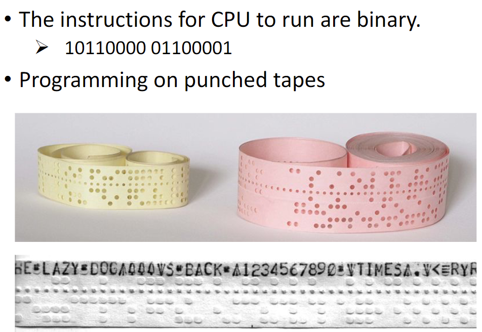

# C/C++程序设计

## Week01

### 1.1 The first example

### 1.2 Different programming languages

#### Binary Instructions for CPU



#### Assembly Language

```assembly
MOV AL, 61h; load 61h into AL
```

#### High-level Language

- c: 1973
- c++: 1979
  - c With Classes
  - C+++++++++++++
- Java: 1995
  - Memory management
  - "Write once, run anywhere" not "Write once, compile everywhere". Both "Write once, test everywhere"
- Python: 1990
  - no strict grammar
  - no too many data types

#### Advantages of C/C++

- Development language of most fundamental computer systems
  - Linux
  - MySQL
  - OpenCV
  - Backend of Tensorflow and Pytorch
  - High efficiency

#### Even Higher-level Language

- Scratch

### 1.3 Compile and Link

#### How to Compile and Link

```sh
g++ *.cpp   #编译生成a.out可执行文件

g++ *.cpp -o xxx    #指定输出文件名
g++ *.cpp -c    #只编译生成.o文件，而不链接
g++ *.o *.o #将.o文件链接

# or
g++ *.cpp *.cpp

```

#### Errors

- Compile errors:
  - Grammar error
- Link errors:
  - "Symbol not found" or "Undefined symbol"
- Runtime errors:
  - Successfully compiled and linked
  - The floating point exception(divided by 0)

### 1.4 Preprocessor and macros 预处理和宏

#### Preprocessor

```c++
#include "mul.hpp"
// ------>
int mul(int a, int b);
```

#### Macros

```c++
#define PI 3.14
```

- 这里的PI不是变量，而是一个宏，它在编译时被替换为3.14。

```c++
return PI * r * r;
// ------>
return 3.14 * r * r;
```

### 1.5 Simple input and output

#### C++ Style Output

```c++
cout << "Hello, World!" << endl;
```

#### C++ Style Input

```c++
int a;
float b;
cin >> a;
cin >> b;
```

#### C Style Output

```c
int v = 0;
printf("Hello, value = %d\n", v);
```

#### C Style Input

```c
int v;
scanf("%d", &v);
```

### Quiz for week01

#### 1. IDE is a compiler and xxxxxxxx. (False)

#### 2. You need to define a function after you declare it in an header file. (True)

#### 3. The argc of "./a.out 1 2 3" is 4

- argc: argument **count**
- argv: argument vector
